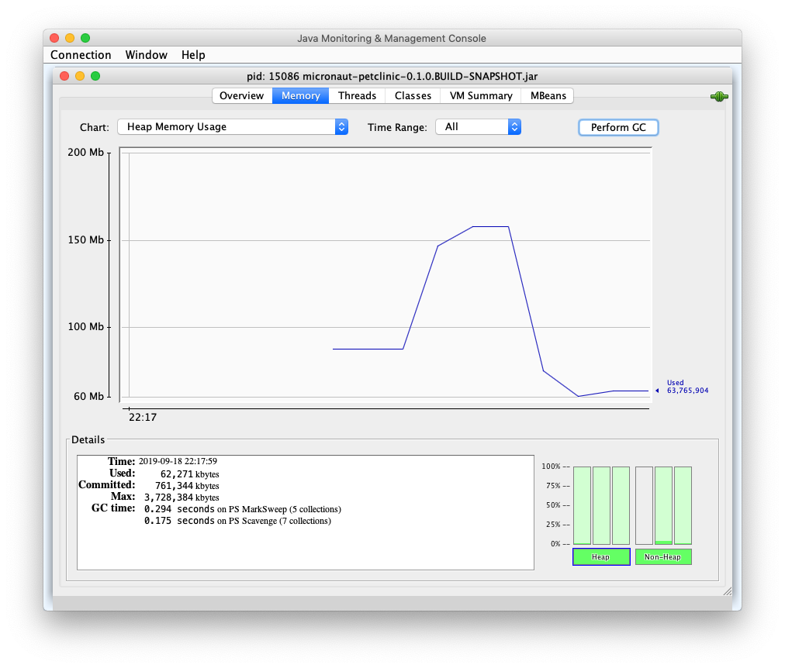

# Introduction

The aim of this repo is to measure some features of a Micronaut application and its Docker image. 
Instead of creating a new Micronaut demo from scratch, it is based on 
[Micronaut migration](https://github.com/graemerocher/micronaut-petclinic) 
of [Spring PetClinic](https://github.com/spring-projects/spring-petclinic).

#  Size

## Spring Boot artifact's size

Build PetClinic application:

```
git clone https://github.com/wearearima/micronaut-docker-study.git
cd micronaut-docker-study
./mvnw clean package
```

Measure the jar files:

```
ls -lh target/*.jar*
```

Result:

```
-rw-r--r--  1 inigotelleria  staff    37M Sep 18 22:12 target/micronaut-petclinic-0.1.0.BUILD-SNAPSHOT.jar
-rw-r--r--  1 inigotelleria  staff   637K Sep 18 22:12 target/original-micronaut-petclinic-0.1.0.BUILD-SNAPSHOT.jar
```

The file named `micronaut-petclinic-0.1.0.BUILD-SNAPSHOT` is the resulting fat jar because it includes
PetClinic's code and its dependencies. The other file, prefixed `.original`, is just PetClinic's code
without its dependencies. The result is that our code size is `637K` and the dependencies' `37M`. 

## Docker image's size

Build PetClinic's Docker image:

```
./mvnw jib:dockerBuild
```

Measure the image size:

```
docker image ls | grep micronaut-petclinic
```

Result:

```
micronaut-petclinic                                              0.1.0.BUILD-SNAPSHOT    7607b6166a45        49 years ago        129MB
```

We can see that size of the artifact has increased from `36M` to `129MB`. This is mainly because the 
Docker image includes the JDK and Linux images. Run this command to check it:

```
docker image history micronaut-petclinic:0.1.0.BUILD-SNAPSHOT
```

The result shows the different layers added to the Docker image:

```
[micronaut-docker-study] docker image history micronaut-petclinic:0.1.0.BUILD-SNAPSHOT                                                                                                                                                                       master  ✭ ✱
IMAGE               CREATED             CREATED BY                                      SIZE                COMMENT
7607b6166a45        49 years ago        jib-maven-plugin:1.5.1                          598kB               classes
<missing>           49 years ago        jib-maven-plugin:1.5.1                          936kB               resources
<missing>           49 years ago        jib-maven-plugin:1.5.1                          432kB               snapshot dependencies
<missing>           49 years ago        jib-maven-plugin:1.5.1                          37.2MB              dependencies
<missing>           3 days ago          /bin/sh -c #(nop)  ENV JAVA_HOME=/opt/java/o…   0B                  
<missing>           3 days ago          /bin/sh -c set -eux;     apk add --no-cache …   75.7MB              
<missing>           3 days ago          /bin/sh -c #(nop) COPY multi:cf4be6a9ef2b0c0…   15.6kB              
<missing>           3 days ago          /bin/sh -c #(nop)  ENV JAVA_VERSION=jdk8u222…   0B                  
<missing>           3 days ago          /bin/sh -c apk add --no-cache --virtual .bui…   8.88MB              
<missing>           3 days ago          /bin/sh -c #(nop)  ENV LANG=en_US.UTF-8 LANG…   0B                  
<missing>           4 weeks ago         /bin/sh -c #(nop)  CMD ["/bin/sh"]              0B                  
<missing>           4 weeks ago         /bin/sh -c #(nop) ADD file:fe64057fbb83dccb9…   5.58MB     
```

The `5.58MB` image is the Alpine Linux image and the `75.7MB` image is the JDK8 image. The sum of all layers results in 
an image of `129MB` which includes Linux OS, JDK8, PetClinic's code and dependencies' jar.  

> Different Linux image comparison at https://github.com/gliderlabs/docker-alpine#why 

# Startup time

Before running PetClinic application the database must be started with this command:

```
docker-compose run --publish 5432:5432 db 
``` 

Afterwards, run PetClinic application with this command:

```
java -jar target/micronaut-petclinic-0.1.0.BUILD-SNAPSHOT.jar
```

The applications starts in `2,31 seconds` using AdoptOpenJDK 1.8.0_222-b10:

```
Startup completed in 2310ms. Server Running: http://localhost:8080
```

# Memory usage

After navigating through the application to make sure all beans are loaded, open `JConsole` or other profiler such as 
YourKit. Measure the heap after executing Garbage Collector (GC). 



With no load the application's heap consumption is around `60MB` . However, the memory consumption is bigger than just the
heap, so let's measure it using ``ps`` command:

```
[micronaut-docker-study] ps aux 14526
USER    PID  %CPU %MEM      VSZ    RSS   TT  STAT STARTED      TIME COMMAND
inigo    14526   0.0  3.3 10414692 561908 s005  S+   10:17PM   0:10.81 /usr/bin/java -jar target/micronaut-petclinic-0.1.0.BUILD-SNAPSHOT.jar
```

We can see that PetClinic's process actually is using almost `560MB` of memory.  

# Summary

| Feature                                           | Micronaut 1.2.2   |
| ------------------------------------------------- | ----------------- |
| Micronaut App disk usage                          | 37M               |
| Micronaut App disk usage (without dependencies)   | 637KB             |
| Docker Container disk usage                       | 129MB             |
| Micronaut App startup time                        | 2,31 seconds      |
| Micronaut App heap consumption                    | 60MB              |
| Micronaut App memory usage                        | 560MB             |

# Credits

Original PetClinic by https://www.spring.io

Micronaut PetClinic by [Graeme Rocher github repository](https://github.com/graemerocher/micronaut-petclinic)


